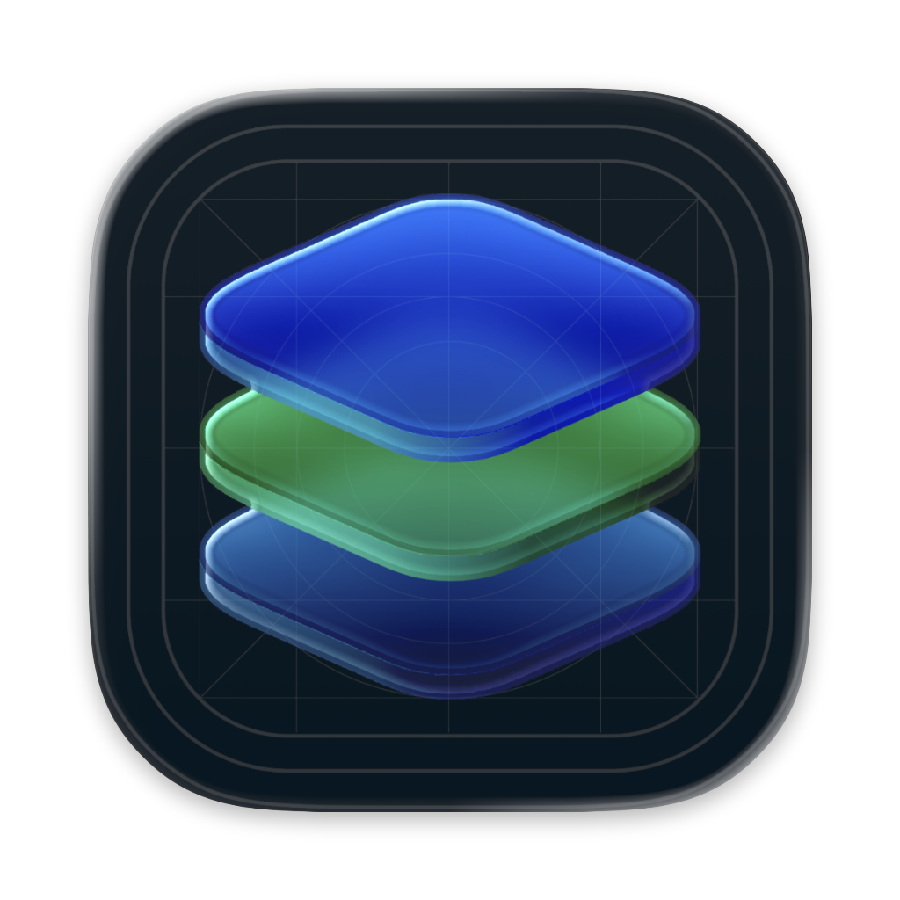
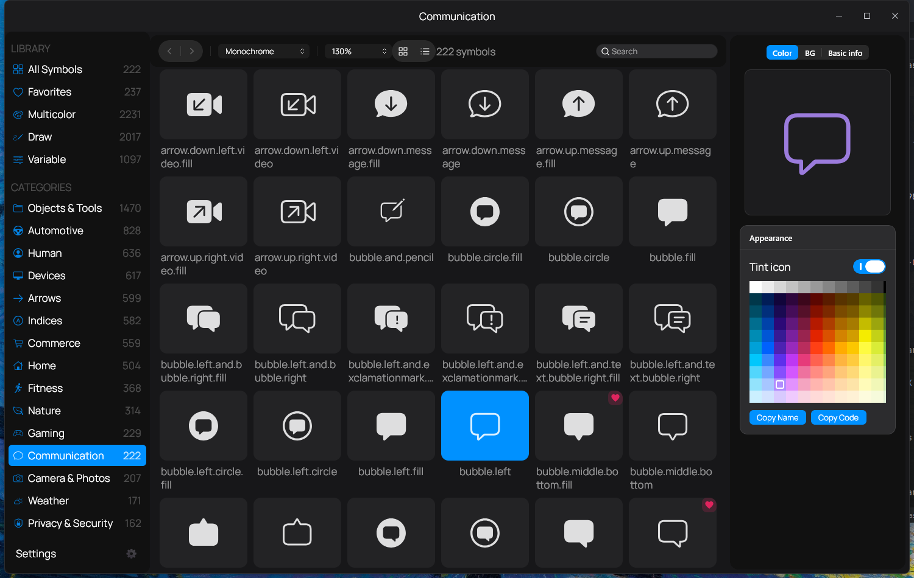
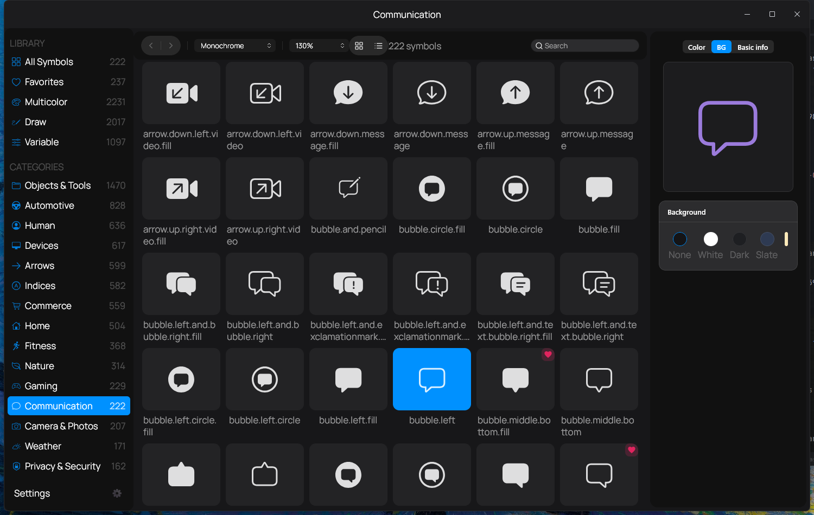

<p align="center">
  
</p>

<h1 align="center">SF Symbols Catalog</h1>

<p align="center">Find an icon. Style it. Paste working Compose code into your project.</p>

Browse all **7,007 Apple SF Symbols** in Dualtone and Monochrome on Windows,
macOS, and Linux. Search by name, category, synonym, or typo; preview a symbol
with your colors; then copy a complete Compose function with the correct imports.
Icons come from the companion **[Jetpack_SF_Symbols](https://github.com/cosmictaserdev-creator/Jetpack_SF_Symbols)** library and keep their original proportions.

[](LICENSE)

[](https://developer.apple.com/sf-symbols/)
[](https://github.com/cosmictaserdev-creator/Jetpack_SF_Symbols)
[](https://ko-fi.com/cosmictaser)
[](https://cosmictaser.de5.net)
[](https://github.com/cosmictaserdev-creator/SF_Symbol_Catalog/actions/workflows/build.yml)

[Download installers](https://github.com/cosmictaserdev-creator/SF_Symbol_Catalog/releases) · [Build artifacts](https://github.com/cosmictaserdev-creator/SF_Symbol_Catalog/actions/workflows/build.yml) · [Compose code](#copying-compose-code) · [MCP setup](#mcp-setup) · [Support](#supporting-the-project)



*Browse a category and inspect a symbol with your selected tint.*

<details>
<summary>Inspector and background controls</summary>



*Choose a background, then copy the complete styled Compose function from any inspector tab.*

</details>

---

## Features

- **7,007 SF Symbols** in Dualtone (default) and Monochrome variants, rendered at their true aspect ratio
- **Smart search** — fuzzy, typo-tolerant, and **tag-aware**: every symbol carries far-guess tags, so `garbage` finds `trash`, `logout` finds `rectangle.portrait.and.arrow.right`, `ai` finds `sparkles`, `money` finds `dollarsign`
- **SF Symbols-style sidebar** — a *Library* section (All, Favorites, Multicolor, Variable, Draw) above every category, each led by its own glyph, with live counts
- **Favorites** — persisted across sessions
- **Multi-select** to favorite or un-favorite symbols in bulk
- **Copy to clipboard** in one click:
  - Apple name (`heart.fill`)
  - Pascal name (`SFHeartFill`)
  - Complete Compose function with imports, selected variant, tint (including alpha), and chosen background
- **Inspector** with large preview, tint color, background swatches, categories and tags
- Grid and list views with adjustable grid size
- Light / dark theme, native **macOS glass** look on every platform

## Downloads

Installers are built on native GitHub Actions runners and attached to tagged [GitHub Releases](https://github.com/cosmictaserdev-creator/SF_Symbol_Catalog/releases). Builds from `master` are available as [workflow artifacts](https://github.com/cosmictaserdev-creator/SF_Symbol_Catalog/actions/workflows/build.yml):

| Platform | Installer |
|----------|-----------|
| Windows | `.msi` |
| macOS   | `.dmg` |
| Linux   | `.deb` |

The Windows installer includes Java, the app icon, a desktop shortcut, and a
Start menu entry. It installs for the current user and supports version upgrades.
Each online build runs the search, category, and clipboard regression tests plus
a real MCP client exchange before building its installer. Download the artifact
for your operating system; extract the ZIP to find the installer.

## Usage

Type in the search field or pick a category in the sidebar. Click a symbol to inspect it, then copy its name or code snippet from the inspector. Use **Settings** to tune theme and layout.

Search tips:

- Plain words work: `home`, `settings`, `delete`, `share`, `refresh`
- Typos are forgiven: `chekmark`, `magnifyingglas`
- Apple names work too: `arrow.right.circle.fill`

## Using the icons in your own app

The catalog's icons are the same `ImageVector`s shipped by **[Jetpack_SF_Symbols](https://github.com/cosmictaserdev-creator/Jetpack_SF_Symbols)**. Copy the code snippet from the catalog and add the library:

```kotlin
// settings.gradle.kts
maven("https://jitpack.io")

// build.gradle.kts
implementation("com.github.cosmictaserdev-creator:Jetpack_SF_Symbols:1.0.4")
```

```kotlin
Icon(
    imageVector = SfSymbols.Dualtone.SFHeartFill,
    contentDescription = "Favorite",
)
```

## Search tags

Tags live in [`app/src/jvmMain/resources/symbol_tags.txt`](app/src/jvmMain/resources/symbol_tags.txt), one line per key:

```
trash: delete remove bin garbage rubbish discard waste
square.and.arrow.up: share export send upload
```

A key is either a single name segment (`trash` tags `trash`, `trash.fill`, `trash.circle`, …) or a full Apple name. Add a line, rebuild, and the new words are searchable. PRs with better guesses are welcome.

## Development

### Requirements

- JDK 21+
- A macOS host is only needed to build the `.dmg`

### Build & run

```bash
./gradlew run          # run the app
./gradlew jvmTest      # run search tests

./gradlew packageMsi   # Windows installer
./gradlew packageDmg   # macOS installer
./gradlew packageDeb   # Linux installer
```

The Windows MSI installs for the current user, includes its own Java runtime,
and creates desktop and Start menu shortcuts with the app icon. The installer
lets you choose its destination. Release tags supply the package version;
for a local versioned build, use `./gradlew packageMsi -PappVersion=1.1.0`.

### MCP setup

Requires Java 21+. Build the headless server once (and rebuild after changes):

```bash
./gradlew assembleMcp
python scripts/test_mcp.py
```

Add this to your MCP client's configuration, replacing the classpath with the
absolute path to this checkout's `app/build/mcp/lib/*`. On Windows, forward
slashes work and avoid JSON escaping. If Java is not on the client's PATH,
use the full path to your Java 21+ executable as `command`.

```json
{
  "mcpServers": {
    "sf-symbols-catalog": {
      "command": "java",
      "args": [
        "-Djava.awt.headless=true",
        "-cp",
        "/absolute/path/to/SF_Symbol_Catalog/app/build/mcp/lib/*",
        "com.sfsymbols.MainKt",
        "--mcp"
      ]
    }
  }
}
```

Settings shows the classpath for the local build when available. The assembled
folder also contains `mcp.cmd` and `mcp.sh` launchers; run the latter with `sh`.
Keep the `lib` directory beside the launcher when moving the folder.

The client launches a separate process; the desktop window does not need to be
open. The server supports `initialize`, `ping`, `tools/list`, and `tools/call`,
with `search_symbols` and `get_symbol`. It exits when the client closes stdin.
Use the assembled launcher or Java command above: Gradle logs on stdout and
`java -jar app-jvm.jar` are unsuitable for an MCP connection.
The transport follows the [MCP stdio specification](https://modelcontextprotocol.io/specification/2025-11-25/basic/transports).

### Copying Compose code

Select a symbol, choose Dualtone or Monochrome, and set the inspector's tint and
background. **Copy Code** copies a complete `@Composable` function with imports,
the extension-property import, a 110 dp icon, your ARGB tint, and an optional
240 dp rounded background. Turning **Tint icon** off emits `Color.Unspecified`
so the vector keeps its original colors. **Copy Name** copies the Apple name.

Paste the code into a Kotlin file after its `package` line and call the generated
function (for example, `SFHeartFillIcon()`) from your UI. Add the companion icon
library dependency and JitPack repository once, as described above and in the
copied comments; the catalog's private `com.sfsymbols.data` package is not needed.

### Updating icons from Jetpack_SF_Symbols

Icons are vendored from the library with the package renamed to `com.sfsymbols.data`:

```bash
git clone --depth 1 https://github.com/cosmictaserdev-creator/Jetpack_SF_Symbols ../Jetpack_SF_Symbols
SRC=../Jetpack_SF_Symbols/sfsymbols/src/main/java/com/composables/sfsymbols
DST=app/src/jvmMain/kotlin/com/sfsymbols/data
for v in dualtone monochrome; do
  cp $SRC/$v/*.kt $DST/$v/
  sed -i 's/com\.composables\.sfsymbols/com.sfsymbols.data/g' $DST/$v/*.kt
done
cp $SRC/SfIconBuilder.kt $DST/ && sed -i 's/com\.composables\.sfsymbols/com.sfsymbols.data/' $DST/SfIconBuilder.kt
```

### Project layout

```
app/src/jvmMain/
├── kotlin/com/sfsymbols/
│   ├── data/          # icon catalogs, fuzzy search, tags, favorites
│   ├── mcp/           # MCP server for tooling integration
│   ├── ui/            # sidebar, grid, inspector, settings
│   ├── util/          # clipboard + URL helpers
│   └── viewmodel/     # plain Compose state
└── resources/         # app icon, symbol_tags.txt
```

## Releases

Tags starting with `v` trigger the [release workflow](.github/workflows/release.yml), which builds the `.msi`, `.dmg` and `.deb` on native runners and attaches them to a GitHub Release.

```bash
git tag v1.1.0
git push origin v1.1.0
```

---

## Supporting the Project

The catalog and its icon library are free. Support helps maintain the icons,
search tags, installers, and Compose integration.

<p align="center">
  <a href="https://ko-fi.com/cosmictaser"></a>
  <a href="https://discord.gg/Ejeb4cmzfd"></a>
  <a href="https://cosmictaser.de5.net"></a>
</p>

These are the same support and community links used by
[Jetpack_SF_Symbols](https://github.com/cosmictaserdev-creator/Jetpack_SF_Symbols).
Stars, bug reports, and improved search tags are welcome too.

## Related

- **[Jetpack_SF_Symbols](https://github.com/cosmictaserdev-creator/Jetpack_SF_Symbols)** — the SF Symbols icon library for Jetpack Compose and Compose Multiplatform that powers this catalog

## Attribution & Legal

- Icon vectors derived from [`sf-symbols-lib`](https://github.com/phranck/sf-symbols-lib) by [phranck](https://github.com/phranck), via [Jetpack_SF_Symbols](https://github.com/cosmictaserdev-creator/Jetpack_SF_Symbols).
- SF Symbols glyph design and naming are © Apple Inc. SF Symbols is a trademark of Apple Inc. Review Apple's [SF Symbols license](https://developer.apple.com/sf-symbols/) before using symbols outside Apple platforms.
- This project is for educational, interoperability and design-research purposes.

## License

[MIT](LICENSE)
